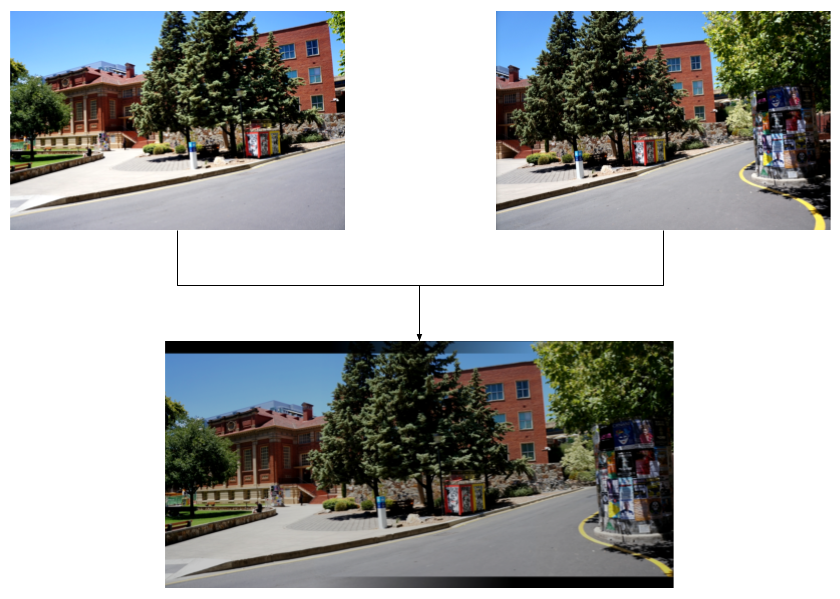
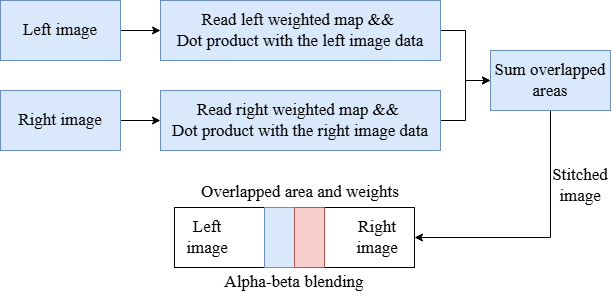
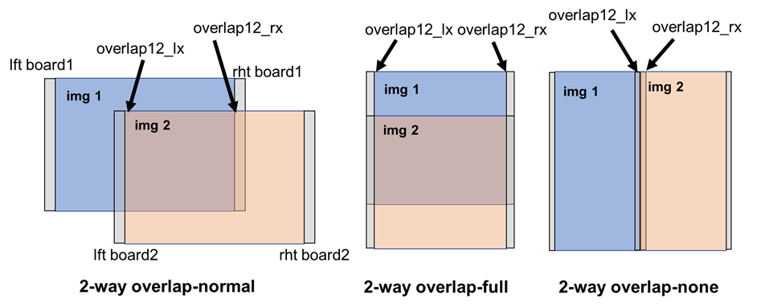
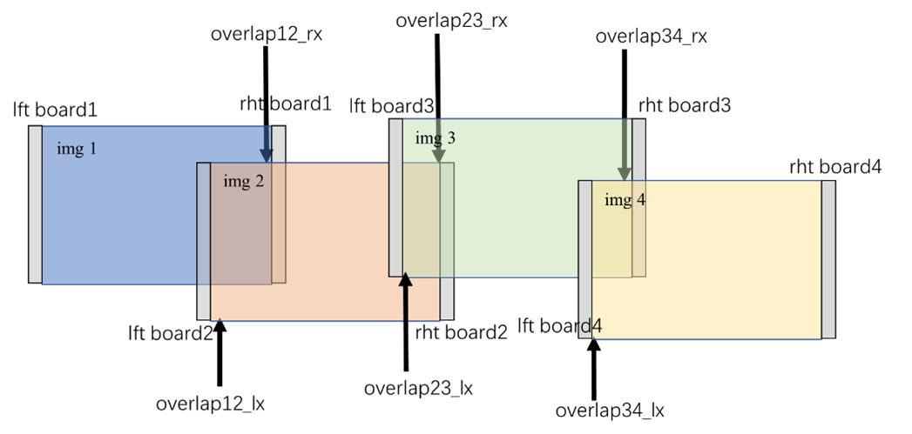

bmcv_blend
---------------------

图片拼接介绍
^^^^^^^^^^^^^^^^^^^^^^^^

图片拼接包括对多路图像进行全景拼接。

.. centered::
	图a：双路拼接示例

算法流程示例
^^^^^^^^^^^^^^^^^^^^^^^^

.. centered::
	图b：Image Stitching算法流程示例

图b展示了基于Image Stitching模块的2路图片拼接的原理。在进行拼接之前，用户需要指定重叠区域及左右权重图（weighted map）；接着，将左右权重图分别与输入的左右图像进行相乘；最后，将结果相加以获得最终的图片拼接结果。

当多路图像输入Image Blend模块前，或需要通过其他模块对多路图片进行影像几何畸变校正 (DWA), 抠图(Crop)，图像缩放(resize)等操作。

Image Blend模块接受双路图片作为输入，通过Image Blend算法根据相同的图像区间，将这些图片拼接在一起。

加速原理介绍
^^^^^^^^^^^^^^^^^^^^^^^^
图片融合模块（Image Blend）用于加速影像拼接的相关计算。对于有着不同图片输入数量的图片拼接任务，拼接方式有多种方案。下图别展示了常用的2路与4路图片拼接方案。

.. centered::
	图c：Image Blend模块双路图片拼接方案示例

.. centered::
	图d：Image Blend模块四路图片拼接方案示例

接口函数介绍
^^^^^^^^^^^^^^^^^^^^^^^^

| 【描述】

| 该 API 可以实现2~4路图片的融合拼接。

| 【语法】

.. code-block:: c
    :linenos:
    :lineno-start: 1
    :force:

    bm_status_t bmcv_blending(
                bm_handle_t handle,
                int input_num,
                bm_image* input,
                bm_image output,
                struct stitch_param stitch_config);

| 【参数】

.. list-table:: bmcv_blending 参数表
    :widths: 12 10 35

    * - **参数名称**
      - **输入/输出**
      - **描述**
    * - handle
      - 输入
      - 设备环境句柄，通过调用 bm_dev_request 获取。
    * - input_num
      - 输入
      - 输入 image 数量，2或3或4。
    * - \*input
      - 输入
      - 输入待拼接 bm_image 对象指针，其指向空间的长度由 input_num 决定。
    * - output
      - 输出
      - 输出拼接后 bm_image 对象。
    * - stitch_config
      - 输入
      - 该结构描述了拼接融合中所需要设置的参数。

| 【数据类型说明】

.. code-block:: c
    :linenos:
    :lineno-start: 1
    :force:

    struct stitch_param {
        struct bm_stitch_src_ovlp_attr ovlap_attr;
        struct bm_stitch_src_bd_attr bd_attr;
        bm_device_mem_t wgt_phy_mem[3][2];
        enum bm_stitch_wgt_mode wgt_mode;
    };

.. list-table:: stitch_param 参数介绍
    :widths: 15 35

    * - **参数名称**
      - **描述**
    * - ovlap_attr
      - 输入源重叠区域属性。
    * - bd_attr
      - 输入域左右边界区域属性，目前参数未开放，设为0。
    * - wgt_phy_mem
      - 权重图的物理地址和大小。
    * - wgt_mode
      - 权重图的模式。

.. code-block:: c
    :linenos:
    :lineno-start: 1
    :force:

    struct bm_stitch_src_ovlp_attr {
        short ovlp_lx[3];
        short ovlp_rx[3];
    };

.. list-table:: bm_stitch_src_ovlp_attr 参数介绍
    :widths: 15 35

    * - **参数名称**
      - **描述**
    * - ovlp_lx
      - 重叠区域左边界点x坐标。
    * - ovlp_rx
      - 重叠区域右边界点x坐标。

.. code-block:: c
    :linenos:
    :lineno-start: 1
    :force:

    struct bm_stitch_src_bd_attr {
        short bd_lx[4];
        short bd_rx[4];
    };

.. list-table:: bm_stitch_src_bd_attr 参数介绍
    :widths: 15 35

    * - **参数名称**
      - **描述**
    * - bd_lx
      - 左侧图片的黑边宽度。
    * - bd_rx
      - 右侧图片的黑边宽度。

.. code-block:: c
    :linenos:
    :lineno-start: 1
    :force:

    typedef struct bm_mem_desc {
      union {
        struct {
    #ifdef __linux__
          unsigned long device_addr;
    #else
          unsigned long long device_addr;
    #endif
          unsigned int reserved;
          int dmabuf_fd;
        } device;

        struct {
          void *system_addr;
          unsigned int reserved0;
          int reserved1;
        } system;
      } u;

      bm_mem_flags_t flags;
      unsigned int size;
    } bm_mem_desc_t;

.. list-table:: bm_device_mem_t wgt_phy_mem 参数介绍
    :widths: 15 35

    * - **参数名称**
      - **描述**
    * - wgt_phy_mem[0][0]
      - 第1处融合区域，y通道权重图数据。
    * - wgt_phy_mem[0][1]
      - 第1处融合区域，uv通道权重图数据。
    * - device_addr
      - 权重图的物理地址。
    * - size
      - 权重图的字节数大小。

.. code-block:: c
    :linenos:
    :lineno-start: 1
    :force:

    enum bm_stitch_wgt_mode {
        BM_STITCH_WGT_YUV_SHARE = 0,
        BM_STITCH_WGT_UV_SHARE,
        BM_STITCH_WGT_SEP,
    };

.. list-table:: bm_stitch_wgt_mode 参数介绍
    :widths: 25 25

    * - **参数名称**
      - **描述**
    * - BM_STITCH_WGT_YUV_SHARE
      - YUV share alpha and beta (1 alpha + 1 beta)，优先推荐这个。
    * - BM_STITCH_WGT_UV_SHARE
      - UV share alpha and beta  (2 alpha + 2 beta)，不推荐选这个。

| 【返回值】

* BM_SUCCESS: 成功

* 其他: 失败

【格式支持】

* 图像stride 要求16byte对齐。  输入图片最小像素支持 64x64，最大支持4608x8192。
* 输入输出数据类型要求：DATA_TYPE_EXT_1N_BYTE。
* 输入、输入格式支持：
    * FORMAT_RGBP_SEPARATE、FORMAT_BGRP_SEPARATE
    * FORMAT_YUV420P、FORMAT_YUV422P
    * FORMAT_YUV444P、FORMAT_GRAY
* 输入输出格式需保持一致；输入输出图片高需要相等。
* wgt_phy_mem 参数，请用bmlib相关api设置，不要直接赋值。例如：bm_malloc_device_byte，bm_memcpy_s2d等。

**示例代码**

.. code-block:: c

  #include "stdio.h"
  #include "stdlib.h"
  #include <unistd.h>
  #include "string.h"
  #include "getopt.h"
  #include "signal.h"
  #include "bmcv_api_ext_c.h"
  #include <stdatomic.h>

  #define ALIGN(x, a)      (((x) + ((a)-1)) & ~((a)-1))
  void bm_dem_read_bin(bm_handle_t handle, bm_device_mem_t* dmem, const char *input_name, unsigned int size)
  {
    if (access(input_name, F_OK) != 0 || strlen(input_name) == 0 || 0 >= size)
    {
      return;
    }

    char* input_ptr = (char *)malloc(size);
    FILE *fp_src = fopen(input_name, "rb+");

    if (fread((void *)input_ptr, 1, size, fp_src) < (unsigned int)size){
        printf("file size is less than %d required bytes\n", size);
    };
    fclose(fp_src);

    if (BM_SUCCESS != bm_malloc_device_byte(handle, dmem, size)){
      printf("bm_malloc_device_byte failed\n");
    }

    if (BM_SUCCESS != bm_memcpy_s2d(handle, *dmem, input_ptr)){
      printf("bm_memcpy_s2d failed\n");
    }

    free(input_ptr);
    return;
  }

  void blend_HandleSig(int signum)
  {

    signal(SIGINT, SIG_IGN);
    signal(SIGTERM, SIG_IGN);

    printf("signal happen  %d \n",signum);

    exit(-1);
  }

  int main() {
    bm_handle_t handle = NULL;
    bm_image    src[2], dst;
    int src_h[2] = {288, 288}, src_w[2] = {2304, 4608}, dst_w = 4608, dst_h = 288, wgtWidth, wgtHeight;
    bm_image_format_ext src_fmt = FORMAT_YUV420P, dst_fmt = FORMAT_YUV420P;
    char *src_name[2] = {"path/to/src1", "path/to/src2"}, *dst_name = "path/to/dst", *wgt_name[2] = {"path/to/wgt1", "path/to/wgt2"};
    int  dev_id = 0, ret = 0,wgt_len =0, input_num =2;

    struct stitch_param stitch_config;
    memset(&stitch_config, 0, sizeof(stitch_config));
    stitch_config.wgt_mode = BM_STITCH_WGT_YUV_SHARE;

    signal(SIGINT, blend_HandleSig);
    signal(SIGTERM, blend_HandleSig);

    bm_status_t ret1    = bm_dev_request(&handle, dev_id);
    if (ret1 != BM_SUCCESS) {
        printf("Create bm handle failed. ret = %d\n", ret);
        exit(-1);
    }
    stitch_config.ovlap_attr.ovlp_rx[0] = 2303;
    stitch_config.ovlap_attr.ovlp_lx[0] = 0;
    wgtWidth = ALIGN(stitch_config.ovlap_attr.ovlp_rx[0] - stitch_config.ovlap_attr.ovlp_lx[0] + 1, 16);
    wgtHeight = src_h[0];

    int byte_size = 0;
    for(int i = 0;i < 2; i++)
    {
      bm_image_create(handle, src_h[i], src_w[i], src_fmt, DATA_TYPE_EXT_1N_BYTE, &src[i],NULL);
      bm_image_alloc_dev_mem(src[i], 1);
      byte_size  = src_w[i] * src_h[i] * 3 /2;
      unsigned char *input_data = (unsigned char *)malloc(byte_size);
      FILE *fp_src = fopen(src_name[i], "rb");
      if (fread((void *)input_data, 1, byte_size, fp_src) < (unsigned int)byte_size) {
        printf("file size is less than required bytes%d\n", byte_size);
      };
      fclose(fp_src);
      void* in_ptr[4] = {(void *)input_data, (void *)((unsigned char*)input_data + src_w[i] * src_h[i]), (void *)((unsigned char*)input_data + src_w[i] * src_h[i] * 5 / 4)};
      bm_image_copy_host_to_device(src[i], in_ptr);
      wgt_len = wgtWidth * wgtHeight;
      if (stitch_config.wgt_mode == BM_STITCH_WGT_UV_SHARE)
        wgt_len = wgt_len << 1;

      bm_dem_read_bin(handle, &stitch_config.wgt_phy_mem[0][i], wgt_name[i],  wgt_len);
    }
    bm_image_create(handle, dst_h, dst_w, dst_fmt, DATA_TYPE_EXT_1N_BYTE, &dst,NULL);
    bm_image_alloc_dev_mem(dst, 1);

    ret = bmcv_blending(handle, input_num, src, dst, stitch_config);

    unsigned char* output_ptr = (unsigned char*)malloc(byte_size);
    void* out_ptr[4] = {(void*)output_ptr, (void*)((unsigned char*)output_ptr + dst_w * dst_h), (void*)((unsigned char*)output_ptr + dst_w * dst_h * 5 / 4)};
    bm_image_copy_device_to_host(dst, (void **)out_ptr);

    FILE *fp_dst = fopen(dst_name, "wb");
    if (fwrite((void *)output_ptr, 1, byte_size, fp_dst) < (unsigned int)byte_size){
        printf("file size is less than %d required bytes\n", byte_size);
    };
    fclose(fp_dst);

    bm_image_destroy(&src[0]);
    bm_image_destroy(&src[1]);
    bm_image_destroy(&dst);
    bm_dev_free(handle);

    return ret;

  }

