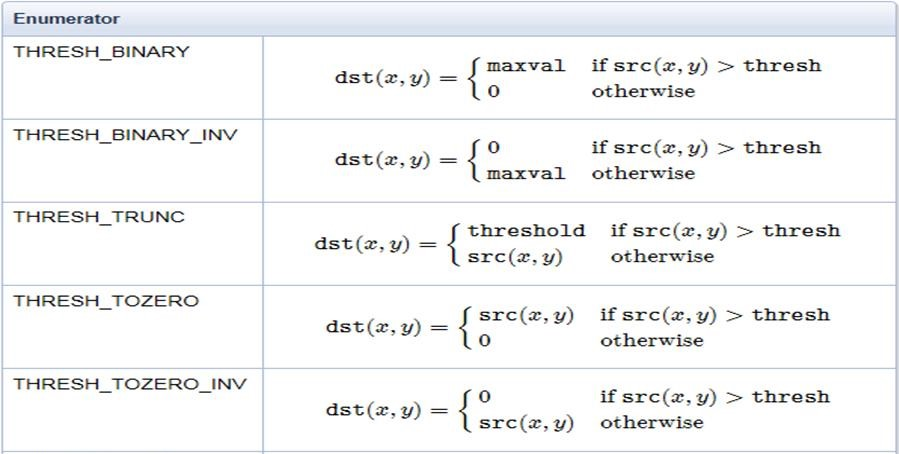

bmcv_image_threshold
------------------------------

**描述：**

该接口用于对图像进行像素阈值化操作。

**语法：**

.. code-block:: c
    :linenos:
    :lineno-start: 1
    :force:

    bm_status_t bmcv_image_threshold(
        bm_handle_t handle,
        bm_image input,
        bm_image output,
        unsigned char thresh,
        unsigned char max_value,
        bm_thresh_type_t type);

其中thresh类型如下：

.. code-block:: c
    :linenos:
    :lineno-start: 1
    :force:

    typedef enum {
        BM_THRESH_BINARY = 0,
        BM_THRESH_BINARY_INV,
        BM_THRESH_TRUNC,
        BM_THRESH_TOZERO,
        BM_THRESH_TOZERO_INV,
        BM_THRESH_TYPE_MAX
    } bm_thresh_type_t;

各个类型对应的具体公式如下：

**参数：**

.. list-table:: bmcv_image_threshold 参数表
    :widths: 15 15 35

    * - **参数名称**
      - **输入/输出**
      - **描述**
    * - handle
      - 输入
      - 设备环境句柄，通过调用bm_dev_request获取。
    * - input
      - 输入
      - 输入参数。输入图像的 bm_image，bm_image 需要外部调用 bmcv_image_create 创建。image 内存可以使用 bm_image_alloc_dev_mem 或者 bm_image_copy_host_to_device 来开辟新的内存，或者使用 bmcv_image_attach 来 attach 已有的内存。
    * - output
      - 输出
      - 输出参数。输出 bm_image，bm_image 需要外部调用 bmcv_image_create 创建。image 内存可以通过 bm_image_alloc_dev_mem 来开辟新的内存，或者使用 bmcv_image_attach 来 attach 已有的内存。如果不主动分配将在 api 内部进行自行分配。
    * - thresh
      - 输入
      - 像素阈值，取值范围为0-255。
    * - max_value
      - 输入
      - 阈值化操作后的像素最大值，取值范围为0-255。
    * - type
      - 输入
      - 阈值化类型，取值范围为0-4。

**返回值：**

该函数成功调用时, 返回BM_SUCCESS。

**格式支持：**

该接口目前支持以下图像格式:

+-----+------------------------+
| num | image_format           |
+=====+========================+
| 1   | FORMAT_BGR_PACKED      |
+-----+------------------------+
| 2   | FORMAT_BGR_PLANAR      |
+-----+------------------------+
| 3   | FORMAT_RGB_PACKED      |
+-----+------------------------+
| 4   | FORMAT_RGB_PLANAR      |
+-----+------------------------+
| 5   | FORMAT_RGBP_SEPARATE   |
+-----+------------------------+
| 6   | FORMAT_BGRP_SEPARATE   |
+-----+------------------------+
| 7   | FORMAT_GRAY            |
+-----+------------------------+
| 8   | FORMAT_YUV420P         |
+-----+------------------------+
| 9   | FORMAT_YUV422P         |
+-----+------------------------+
| 10  | FORMAT_YUV444P         |
+-----+------------------------+
| 11  | FORMAT_NV12            |
+-----+------------------------+
| 12  | FORMAT_NV21            |
+-----+------------------------+
| 13  | FORMAT_NV16            |
+-----+------------------------+
| 14  | FORMAT_NV61            |
+-----+------------------------+
| 15  | FORMAT_NV24            |
+-----+------------------------+

该接口目前支持的数据格式：

+-----+------------------------+
| num | data_type              |
+=====+========================+
| 1   | DATA_TYPE_EXT_1N_BYTE  |
+-----+------------------------+

**注意事项：**

1. 在调用该接口之前必须确保输入图像的内存已经申请。

2. 输入输出图像的数据格式，图像格式必须相同。

3. 目前支持的图像最大宽和高为4096。

**代码示例：**

.. code-block:: c
    :linenos:
    :lineno-start: 1
    :force:

    int channel   = 1;
    int width     = 1920;
    int height    = 1080;
    int dev_id    = 0;
    bm_handle_t handle;
    bm_status_t dev_ret = bm_dev_request(&handle, dev_id);
    unsigned char *src_data = (unsigned char*)malloc(width * height * channel);
    unsigned char *res_data = (unsigned char*)malloc(width * height * channel);
    for (int i = 0; i < channel * width * height; i++) {
        src_data[i] = rand() % 255;
    }
    bm_image input, output;
    bm_image_create(handle, height, width, FORMAT_GRAY, DATA_TYPE_EXT_1N_BYTE, &input, NULL);
    bm_image_create(handle, height, width, FORMAT_GRAY, DATA_TYPE_EXT_1N_BYTE, &output, NULL);
    bm_image_alloc_dev_mem(input, 1);
    bm_image_alloc_dev_mem(output, 1);
    unsigned char* in_ptr[3] = {src_data, src_data + height * width, src_data + 2 * height * width};
    bm_image_copy_host_to_device(input, (void **)in_ptr);
    if (BM_SUCCESS != bmcv_image_threshold(handle, input, output, 200, 200, BM_THRESH_BINARY)) {
        printf("bmcv thresh error !!!\n");
        bm_image_destroy(&input);
        bm_image_destroy(&output);
        bm_dev_free(handle);
        exit(-1);
    }
    unsigned char* out_ptr[3] = {res_data, res_data + height * width, res_data + 2 * height * width};
    bm_image_copy_device_to_host(output, (void **)out_ptr);
    bm_image_destroy(&input);
    bm_image_destroy(&output);
    free(src_data);
    free(res_data);
    bm_dev_free(handle);