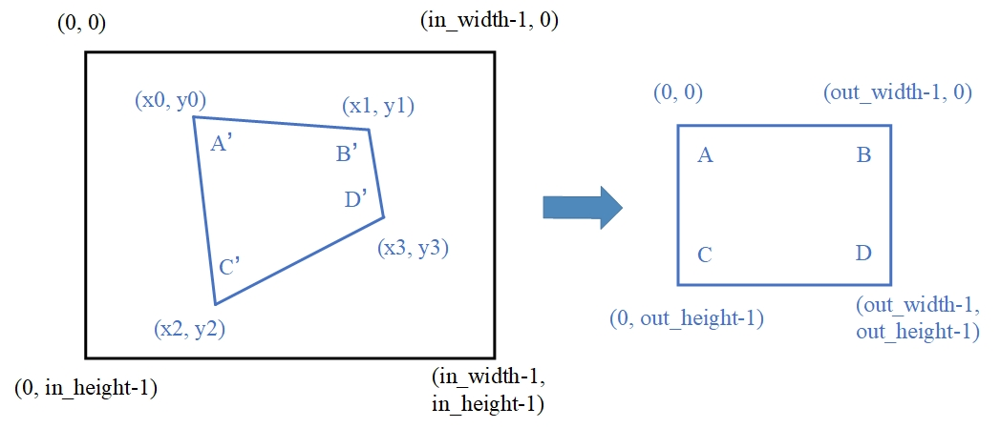

bmcv_image_warp_perspective
============================

该接口实现图像的透射变换，又称投影变换或透视变换。透射变换将图片投影到一个新的视平面，是一种二维坐标 (:math:`x_0` , :math:`y_0`) 到二维坐标(:math:`x` , :math:`y`)的非线性变换，该接口的实现是针对输出图像的每一个像素点坐标得到对应输入图像的坐标，然后构成一幅新的图像，其数学表达式形式如下：

  .. math::

      \left\{
      \begin{array}{c}
      x'=a_1x+b_1y+c_1 \\
      y'=a_2x+b_2y+c_2 \\
      w'=a_3x+b_3y+c_3 \\
      x_0 = x' / w'          \\
      y_0 = y' / w'          \\
      \end{array}
      \right.

对应的齐次坐标矩阵表示形式为：

.. math::

      \left[\begin{matrix} x' \\ y' \\ w' \end{matrix} \right]=\left[\begin{matrix} a_1&b_1&c_1 \\ a_2&b_2&c_2 \\ a_3&b_3&c_3 \end{matrix} \right]\times \left[\begin{matrix} x \\ y \\ 1 \end{matrix} \right]

.. math::

      \left\{
      \begin{array}{c}
      x_0 = x' / w'   \\
      y_0 = y' / w'   \\
      \end{array}
      \right.

坐标变换矩阵是一个 9 点的矩阵（通常c3 = 1），利用该变换矩阵可以从输出图像坐标推导出对应的输入原图坐标，该变换矩阵可以通过输入输出图像对应的 4 个点的坐标来获取。

为了更方便地完成透射变换，该库提供了两种形式的接口供用户使用：一种是用户提供变换矩阵给接口作为输入; 另一种接口是提供输入图像中 4 个点的坐标作为输入，适用于将一个不规则的四边形透射为一个与输出大小相同的矩形，如下图所示，可以将输入图像A'B'C'D'映射为输出图像ABCD，用户只需要提供输入图像中A'、B'、C'、D'四个点的坐标即可，该接口内部会根据这四个的坐标和输出图像四个顶点的坐标自动计算出变换矩阵，从而完成该功能。

**接口形式一:**

    .. code-block:: c

        bm_status_t bmcv_image_warp_perspective(
                    bm_handle_t handle,
                    int image_num,
                    bmcv_perspective_image_matrix matrix[4],
                    bm_image* input,
                    bm_image* output,
                    int use_bilinear = 0);

其中，bmcv_perspective_matrix 定义了一个坐标变换矩阵，其顺序为 float m[9] = {a1, b1, c1, a2, b2, c2, a3, b3, c3}。
而 bmcv_perspective_image_matrix 定义了一张图片里面有几个变换矩阵，可以实现对一张图片里的多个小图进行透射变换。

    .. code-block:: c

        typedef struct bmcv_perspective_matrix_s{
                float m[9];
        } bmcv_perspective_matrix;

        typedef struct bmcv_perspective_image_matrix_s{
                bmcv_perspective_matrix *matrix;
                int matrix_num;
        } bmcv_perspective_image_matrix;

**接口形式二:**

    .. code-block:: c

        bm_status_t bmcv_image_warp_perspective_with_coordinate(
                    bm_handle_t handle,
                    int image_num,
                    bmcv_perspective_image_coordinate coord[4],
                    bm_image* input,
                    bm_image* output,
                    int use_bilinear = 0);

其中，bmcv_perspective_coordinate 定义了四边形四个顶点的坐标，按照左上、右上、左下、右下的顺序存储。
而 bmcv_perspective_image_coordinate 定义了一张图片里面有几组四边形的坐标，可以实现对一张图片里的多个小图进行透射变换。

    .. code-block:: c

        typedef struct bmcv_perspective_coordinate_s{
                int x[4];
                int y[4];
        } bmcv_perspective_coordinate;

        typedef struct bmcv_perspective_image_coordinate_s{
                bmcv_perspective_coordinate *coordinate;
                int coordinate_num;
        } bmcv_perspective_image_coordinate;

**接口形式三:**

    .. code-block:: c

        bm_status_t bmcv_image_warp_perspective_similar_to_opencv(
                    bm_handle_t handle,
                    int image_num,
                    bmcv_perspective_image_matrix matrix[4],
                    bm_image* input,
                    bm_image* output,
                    int use_bilinear = 0);

本接口中bmcv_perspective_image_matrix 定义的变换矩阵与opencv的warpPerspective接口要求输入的变换矩阵相同，且与接口一中同名结构体定义的矩阵互为逆矩阵，其余参数与接口一相同。

    .. code-block:: c

        typedef struct bmcv_perspective_matrix_s{
                float m[9];
        } bmcv_perspective_matrix;

        typedef struct bmcv_perspective_image_matrix_s{
                bmcv_perspective_matrix *matrix;
                int matrix_num;
        } bmcv_perspective_image_matrix;

**参数说明**

* bm_handle_t handle

  输入参数。输入的 bm_handle 句柄。

* int image_num

  输入参数。输入图片数，最多支持 4。

* bmcv_perspective_image_matrix matrix[4]

  输入参数。每张图片对应的变换矩阵数据结构，最多支持 4 张图片。

* bmcv_perspective_image_coordinate coord[4]

  输入参数。每张图片对应的四边形坐标信息，最多支持 4 张图片。

* bm_image\* input

  输入参数。输入 bm_image，对于 1N 模式，最多 4 个 bm_image，对于 4N 模式，最多一个 bm_image。

* bm_image\* output

  输出参数。输出 bm_image，外部需要调用 bmcv_image_create 创建，建议用户调用 bmcv_image_attach 来分配 device memory。如果用户不调用 attach，则内部分配 device memory。对于输出 bm_image，其数据类型和输入一致，即输入是 4N 模式，则输出也是 4N 模式,输入 1N 模式，输出也是 1N 模式。所需要的 bm_image 大小是所有图片的变换矩阵之和。比如输入 1 个 4N 模式的 bm_image，4 张图片的变换矩阵数目为【3,0,13,5】，则共有变换矩阵 3+0+13+5=21，由于输出是 4N 模式，则需要(21+4-1)/4=6 个 bm_image 的输出。

* int use_bilinear

  输入参数。是否使用 bilinear 进行插值，若为 0 则使用 nearest 插值，若为 1 则使用 bilinear 插值，默认使用 nearest 插值。选择 nearest 插值的性能会优于 bilinear，因此建议首选 nearest 插值，除非对精度有要求时可选择使用 bilinear 插值。

**返回值说明:**

* BM_SUCCESS: 成功

* 其他: 失败

**注意事项**

1. 该接口要求输出图像的所有坐标点都能在输入的原图中找到对应的坐标点，不能超出原图大小，建议优先使用接口二，可以自动满足该条件。

2. 该接口所支持的 image_format 包括：

   +-----+------------------------+
   | num | image_format           |
   +=====+========================+
   |  1  | FORMAT_BGR_PLANAR      |
   +-----+------------------------+
   |  2  | FORMAT_RGB_PLANAR      |
   +-----+------------------------+

3. 该接口所支持的 data_type 包括：

   +-----+------------------------+
   | num | data_type              |
   +=====+========================+
   |  1  | DATA_TYPE_EXT_1N_BYTE  |
   +-----+------------------------+
   |  2  | DATA_TYPE_EXT_4N_BYTE  |
   +-----+------------------------+

4. 该接口的输入以及输出 bm_image 均支持带有 stride。

5. 要求该接口输入 bm_image 的 width、height、image_format 以及 data_type 必须保持一致。

6. 要求该接口输出 bm_image 的 width、height、image_format、data_type 以及 stride 必须保持一致。

**示例代码**

    .. code-block:: c

      #include <stdlib.h>
      #include <stdint.h>
      #include <stdio.h>
      #include <string.h>
      #include <math.h>
      #include "bmcv_api_ext_c.h"

      #define BM_MIN(x, y) (((x)) < ((y)) ? (x) : (y))
      #define BM_MAX(x, y) (((x)) > ((y)) ? (x) : (y))

      #define NO_USE 0
      #define MAX_INT (float)(pow(2, 31) - 2)
      #define MIN_INT (float)(1 - pow(2, 31))
      #define UNUSED(x) (void)(x)

      static int image_sh = 500;
      static int image_sw = 500;
      static int image_dh = 200;
      static int image_dw = 200;
      static int use_bilinear = 0;
      static bm_handle_t handle;

      static int writeBin(const char* path, void* output_data, int size)
      {
          int len = 0;
          FILE* fp_dst = fopen(path, "wb+");

          if (fp_dst == NULL) {
              perror("Error opening file\n");
              return -1;
          }

          len = fwrite((void*)output_data, 1, size, fp_dst);
          if (len < size) {
              printf("file size = %d is less than required bytes = %d\n", len, size);
              return -1;
          }

          fclose(fp_dst);
          return 0;
      }

      static void my_get_perspective_transform(int* sx, int* sy, int dw, int dh, float* matrix) {
          int A = sx[3] + sx[0] - sx[1] - sx[2];
          int B = sy[3] + sy[0] - sy[1] - sy[2];
          int C = sx[2] - sx[3];
          int D = sy[2] - sy[3];
          int E = sx[1] - sx[3];
          int F = sy[1] - sy[3];
          matrix[8] = 1;
          matrix[7] = ((float)(A * F - B * E) / (float)dh) / (float)(C * F - D * E);
          matrix[6] = ((float)(A * D - B * C) / (float)dw) / (float)(D * E - C * F);
          matrix[0] = (matrix[6] * dw * sx[1] + sx[1] - sx[0]) / dw;
          matrix[1] = (matrix[7] * dh * sx[2] + sx[2] - sx[0]) / dh;
          matrix[2] = sx[0];
          matrix[3] = (matrix[6] * dw * sy[1] + sy[1] - sy[0]) / dw;
          matrix[4] = (matrix[7] * dh * sy[2] + sy[2] - sy[0]) / dh;
          matrix[5] = sy[0];
      }

      unsigned char* read_pixel_data(const char* filename, size_t* data_size) {
          FILE* file = fopen(filename, "rb");
          if (!file) {
              fprintf(stderr, "Can not open: %s\n", filename);
			  return NULL;
          }
          fseek(file, 0, SEEK_END);
		  long file_size = ftell(file);
          fseek(file, 0, SEEK_SET);

		  if (file_size <= 0) {
              fprintf(stderr, "invalid file size: %ld\n", file_size);
              fclose(file);
              return NULL;
          }

		  unsigned char* res = (unsigned char*)malloc(file_size);
          if (!res) {
              fprintf(stderr, "malloc failed\n");
              fclose(file);
              return NULL;
          }

		  size_t bytes_read = fread(res, 1, file_size, file);
          if (bytes_read != (size_t)file_size) {
              fprintf(stderr, "Read file error: %s (expect %ld bytes, actual %zu bytes)\n",
                      filename, file_size, bytes_read);
              free(res);
              fclose(file);
              return NULL;
          }

		  fclose(file);
          *data_size = (size_t)file_size;
          return res;
      }

      static bm_status_t src_data_generation(int i, int* coordinate, float* trans_mat, float* tensor_S) {
          int   border_x1                          = rand() % image_sw;
          int   border_x2                          = rand() % image_sw;
          while (border_x1 == border_x2) border_x2 = rand() % image_sw;
          int   border_y1                          = rand() % image_sh;
          int   border_y2                          = rand() % image_sh;
          while (border_y1 == border_y2) border_y2 = rand() % image_sh;
          int   x_min                              = BM_MIN(border_x1, border_x2);
          int   x_max                              = BM_MAX(border_x1, border_x2);
          int   y_min                              = BM_MIN(border_y1, border_y2);
          int   y_max                              = BM_MAX(border_y1, border_y2);

          int x[4], y[4];
          int sx[4], sy[4];
          int idx = rand() % 4;
          x   [0] = x_min + rand() % (x_max - x_min);
          y   [0] = y_min;
          x   [1] = x_max;
          y   [1] = y_min + rand() % (y_max - y_min);
          x   [2] = x_max - rand() % (x_max - x_min);
          y   [2] = y_max;
          x   [3] = x_min;
          y   [3] = y_max - rand() % (y_max - y_min);
          sx  [0] = x[(0 + idx) % 4];
          sy  [0] = y[(0 + idx) % 4];
          sx  [1] = x[(1 + idx) % 4];
          sy  [1] = y[(1 + idx) % 4];
          sx  [2] = x[(3 + idx) % 4];
          sy  [2] = y[(3 + idx) % 4];
          sx  [3] = x[(2 + idx) % 4];
          sy  [3] = y[(2 + idx) % 4];
          printf("src coordinate: (%d %d) (%d %d) (%d %d) (%d %d)\n", sx[0], sy[0], sx[1], sy[1], sx[2], sy[2], sx[3], sy[3]);

          coordinate[0 + i * 8] = sx[0];
          coordinate[1 + i * 8] = sx[1];
          coordinate[2 + i * 8] = sx[2];
          coordinate[3 + i * 8] = sx[3];
          coordinate[4 + i * 8] = sy[0];
          coordinate[5 + i * 8] = sy[1];
          coordinate[6 + i * 8] = sy[2];
          coordinate[7 + i * 8] = sy[3];

          float matrix_cv[9];
          my_get_perspective_transform(sx, sy, image_dw-1, image_dh-1, matrix_cv);
          trans_mat[0 + i * 9] = matrix_cv[0];
          trans_mat[1 + i * 9] = matrix_cv[1];
          trans_mat[2 + i * 9] = matrix_cv[2];
          trans_mat[3 + i * 9] = matrix_cv[3];
          trans_mat[4 + i * 9] = matrix_cv[4];
          trans_mat[5 + i * 9] = matrix_cv[5];
          trans_mat[6 + i * 9] = matrix_cv[6];
          trans_mat[7 + i * 9] = matrix_cv[7];
          trans_mat[8 + i * 9] = matrix_cv[8];

          printf("trans_mat[0 + i * 9] = %f\n", trans_mat[0 + i * 9]);
          printf("trans_mat[1 + i * 9] = %f\n", trans_mat[1 + i * 9]);
          printf("trans_mat[2 + i * 9] = %f\n", trans_mat[2 + i * 9]);
          printf("trans_mat[3 + i * 9] = %f\n", trans_mat[3 + i * 9]);
          printf("trans_mat[4 + i * 9] = %f\n", trans_mat[4 + i * 9]);
          printf("trans_mat[5 + i * 9] = %f\n", trans_mat[5 + i * 9]);
          printf("trans_mat[6 + i * 9] = %f\n", trans_mat[6 + i * 9]);
          printf("trans_mat[7 + i * 9] = %f\n", trans_mat[7 + i * 9]);
          printf("trans_mat[8 + i * 9] = %f\n", trans_mat[8 + i * 9]);

          float*     tensor_SX  = tensor_S;
          float*     tensor_SY  = tensor_SX + image_dh * image_dw;
          for (int y = 0; y < image_dh; y++) {
              for (int x = 0; x < image_dw; x++) {
                  float dx = tensor_SX[y * image_dw + x] * trans_mat[0 + i * 9] +
                      tensor_SY[y * image_dw + x] * trans_mat[1 + i * 9] + trans_mat[2 + i * 9];
                  float dy = tensor_SX[y * image_dw + x] * trans_mat[3 + i * 9] +
                          tensor_SY[y * image_dw + x] * trans_mat[4 + i * 9] + trans_mat[5 + i * 9];
                  float dz = tensor_SX[y * image_dw + x] * trans_mat[6 + i * 9] +
                          tensor_SY[y * image_dw + x] * trans_mat[7 + i * 9] + trans_mat[8 + i * 9];

                  dx = dx / dz;
                  dy = dy / dz;

                  if (dx < MIN_INT || dx > MAX_INT || dy < MIN_INT || dy > MAX_INT || fabs(dz) == 0) {
                      printf("--------- the input data is not leagel! --------- \n");
                      return BM_ERR_DATA;
                  }
              }
          }
          return BM_SUCCESS;
      }

      int main() {
          int dev_id = 0;
          bm_status_t ret = bm_dev_request(&handle, dev_id);
          if (ret != BM_SUCCESS) {
              printf("Create bm handle failed. ret = %d\n", ret);
              exit(-1);
          }
          int matrix_num[4] = {1, 1, 1, 1};
          int image_n = 1;

          int output_num = 0;
          for (int i = 0; i < image_n; i++) {
              output_num += matrix_num[i];
          }

          const char* filename = "/home/linaro/output.bin";
          size_t data_size = 0;
          unsigned char* src_data = read_pixel_data(filename, &data_size);
          if (src_data) {
              printf("Get %zu bytes\n", data_size);
          }
          float*  trans_mat  = (float*) malloc(output_num * 9 * sizeof(float));
          int*    coordinate = (int*) malloc(output_num * 8 * sizeof(int));
          float*  tensor_S   = (float*) malloc(image_dh *image_dw * 2 * sizeof(float));
          float*      tensor_SX  = tensor_S;
          float*      tensor_SY  = tensor_SX + image_dh * image_dw;
          for (int y = 0; y < image_dh; y++) {
              for (int x = 0; x < image_dw; x++) {
                  tensor_SX[y * image_dw + x] = (float)x;
                  tensor_SY[y * image_dw + x] = (float)y;
              }
          }

          for (int i = 0; i < output_num; i++) {
              ret = src_data_generation(i, coordinate, trans_mat, tensor_S);
              while (BM_ERR_DATA == ret)
                  ret = src_data_generation(i, coordinate, trans_mat, tensor_S);
          }

          bmcv_perspective_image_matrix matrix_image[4];
          bmcv_perspective_matrix* matrix = (bmcv_perspective_matrix *)(trans_mat);
          for (int i = 0; i < image_n; i++) {
              matrix_image[i].matrix_num = matrix_num[i];
              matrix_image[i].matrix = matrix;
              matrix += matrix_num[i];
          }

          bm_image src_img[4];
          bm_image_format_ext image_format = FORMAT_BGR_PLANAR;
          bm_image_data_format_ext data_type = DATA_TYPE_EXT_1N_BYTE;
          int in_image_num = image_n;
          int out_image_num = output_num;

          for (int i = 0; i < in_image_num; i++) {
              bm_image_create(
                  handle, image_sh, image_sw, image_format, data_type, src_img + i, NULL);
              int stride = 0;
              // debug
              bm_image_get_stride(src_img[i], &stride);
              void *ptr = (void *)(src_data + 3 * stride * image_sh * i);
              bm_image_copy_host_to_device(src_img[i], (void **)(&ptr));
          }

          // create dst image.
          bm_image* dst_img = (bm_image*)malloc(out_image_num * sizeof(bm_image));

          for (int i = 0; i < out_image_num; i++) {
              bm_image_create(handle, image_dh, image_dw, image_format, data_type, dst_img + i, NULL);
          }
          printf("No coordinate\n");
          ret = bmcv_image_warp_perspective(handle, image_n, matrix_image, src_img, dst_img, use_bilinear);
          int size = 0;
          bm_image_get_byte_size(dst_img[0], &size);
          unsigned char* temp_out = (unsigned char*)malloc(out_image_num * size * sizeof(unsigned char));

          for (int i = 0; i < out_image_num; i++) {
              void *ptr = (void *)(temp_out + size * i);
              bm_image_copy_device_to_host(dst_img[i], (void **)&ptr);
          }

          char *dst_name = "/home/linaro/output_warp.bin";
          writeBin(dst_name, temp_out, size);

          free(temp_out);
          free(dst_img);
          free(src_data);

          free(trans_mat);
          free(coordinate);
          free(tensor_S);

          bm_dev_free(handle);

          return ret;
      }